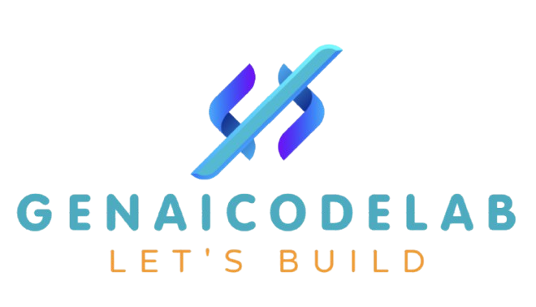

<div align="center">
   
</div>

<div align="center">
    <a target="_blank" href="https://www.youtube.com/@genieincodebottle"></a>&nbsp;
    <a href="https://github.com/genieincodebottle/generative-ai/blob/main/GenAI_Roadmap.md""></a>&nbsp;
    <a target="_blank" href="https://www.instagram.com/genieincodebottle/"></a>
</div>

<br>
Repository for all advanced concepts of GenAI with code.

### 🌟 Overview

- #### [Agents](./agents/) 
- #### Advanced Prompt Engineering
- #### Advanced Agentic-RAG
- #### Multimodal RAG
- and more ...

### ⚙️ Setup Instructions

- #### Prerequisites
   - Python 3.9 or higher
   - pip (Python package installer)

- #### Installation
   1. Clone the repository:
      ```bash
      git clone https://github.com/genieincodebottle/genaicodelab.git
      cd genaicodelab
      ```
   2. Create a virtual environment:
      ```bash
      python -m venv venv
      venv\Scripts\activate # On Linux -> source venv/bin/activate
      ```
   3. Install dependencies:
      ```bash
      pip install -r requirements.txt
      ```
   4. Configure environment variables:

      a) For Agents: Navigate to the following location:
         - agents/agentic_patterns
         - Rename `.env.example` to `.env` and update with appropriate values.

#### Running the Application
To start the application, run:
```bash
streamlit run app.py
```
### 🤝 Contributing
Contributions are welcome! Follow these steps to contribute:
1. Fork the repository.
2. Create a feature branch:
   ```bash
   git checkout -b feature/<feature-name>
   ```
3. Commit your changes:
   ```bash
   git commit -m "Add <feature-description>"
   ```
4. Push to the branch:
   ```bash
   git push origin feature/<feature-name>
   ```
5. Open a pull request.

### 📜 License
This project is licensed under the MIT License. See the LICENSE file for details.

### ✉️ Contact
- **Email:** genieincodebottle@gmail.com
- **GitHub:** [GitHub Profile](https://github.com/genieincodebottle)
