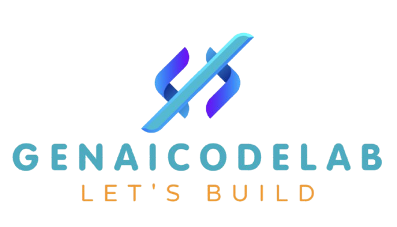

<div align="center">
   
</div>

<div align="center">
    <a target="_blank" href="https://www.youtube.com/@genieincodebottle"></a>&nbsp;
    <a href="https://github.com/genieincodebottle/generative-ai/blob/main/GenAI_Roadmap.md""></a>&nbsp;
    <a target="_blank" href="https://www.instagram.com/genieincodebottle/"></a>
</div>

<br>
Repository for all advanced concepts of GenAI with code and Interview Q & A

### 💼 Interview Q & A

- [Agentic AI Interview Q & A](./docs/agentic-ai-interview-questions.pdf)
- [GenAI Generic Interview Q & A](./docs/genai-interview-questions.pdf)

### ☁️ GenAI with Cloud Guides

- [GenAI with Azure](./docs/genai-with-azure-cloud.pdf)
- [GenAI with AWS](./docs/genai-with-aws-cloud.pdf)
- [GenAI with VertexAI](./docs/genai-with-vertexai.pdf)

### 🌟 Usecases Links

Each link has a README with setup steps, so you can run it independently.

- [Agentic AI](./agentic_ai/)
   - [AI Workflow](./agentic_ai/ai_workflow/)
   - [Agents](./agentic_ai/agents/)
      - [CrewAI Agentic Usecases](./agentic_ai/agents/crewai_usecases/)
      - [LangGraph Agentic Usecases](./agentic_ai/agents/langgraph_usecases/)
      - [Phidata Agentic Usecases](./agentic_ai/agents/phidata_usecases/)
- [Cache Augumented Generation](./cache_augumeted_generation/)
- [Your AI Chat Analytics](./your_ai_chat_analytics/)  
- Advanced Agentic-RAG
- Multimodal RAG
- Advanced Prompt Engineering
- Prompt Guard & Prompt Caching
- and more ...

### ⚙️ Setup Instructions

- #### Prerequisites
   - Python 3.9 or higher
   - pip (Python package installer)

- #### Clone the repository:
      
   ```bash
      git clone https://github.com/genieincodebottle/genaicodelab.git
      cd genaicodelab
   ```

### 🤝 Contributing
Contributions are welcome! Follow these steps to contribute:
1. Fork the repository.
2. Create a feature branch:
   ```bash
   git checkout -b feature/<feature-name>
   ```
3. Commit your changes:
   ```bash
   git commit -m "Add <feature-description>"
   ```
4. Push to the branch:
   ```bash
   git push origin feature/<feature-name>
   ```
5. Open a pull request.

### 📜 License
This project is licensed under the MIT License. See the LICENSE file for details.

### ✉️ Contact
- **Email:** genieincodebottle@gmail.com
- **GitHub:** [GitHub Profile](https://github.com/genieincodebottle)
