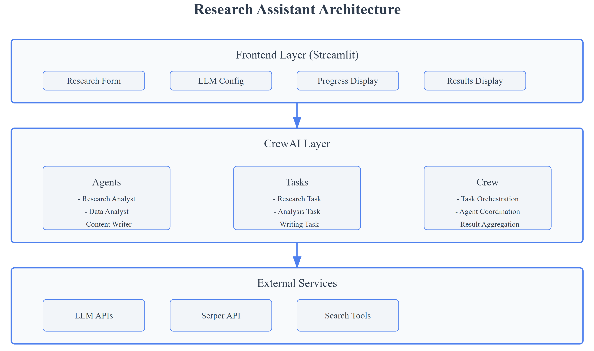

<div align="center">
   <h1>Research Assistant</h1>
</div>

### 📄 [CrewAI Documentation](https://docs.crewai.com/introduction)

### 🛠️ Research Assistant Architecture

   

### ⚙️ Setup Instructions

- #### Prerequisites
   - Python 3.9 or higher
   - pip (Python package installer)

- #### Installation
   1. Clone the repository:
      ```bash
      git clone https://github.com/genieincodebottle/genaicodelab.git
      cd genaicodelab/agentic_ai/agents/crewai_usecases/research_assistant
      ```
   2. Create a virtual environment:
      ```bash
      python -m venv venv
      venv\Scripts\activate # On Linux -> source venv/bin/activate
      ```
   3. Install dependencies:
      ```bash
      pip install -r requirements.txt
      ```
   4. Rename `.env.example` to `.env` and update with appropriate values.
      - For **GROQ_API_KEY** follow this -> https://console.groq.com/keys
      - For **OPENAI_API_KEY** follow this -> https://platform.openai.com/api-keys
      - For **GOOGLE_API_KEY** follow this -> https://ai.google.dev/gemini-api/docs/api-key
      - For **ANTHROPIC_API_KEY** follow this -> https://console.anthropic.com/settings/keys
      - For **SERPER_API_KEY** follow this -> https://serper.dev/api-key
<hr>

### 💻 Running the Application
To start the application, run:
```bash
streamlit run app.py
```