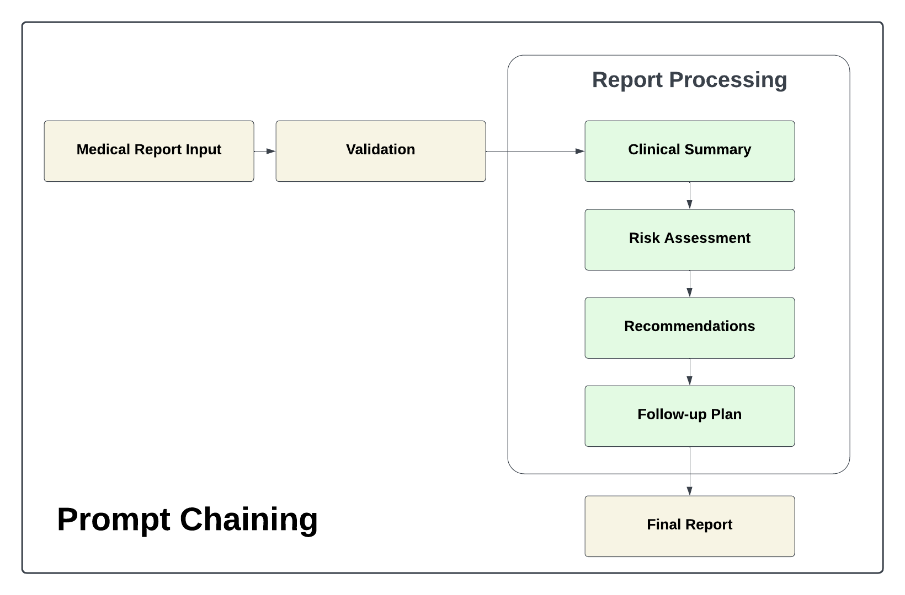
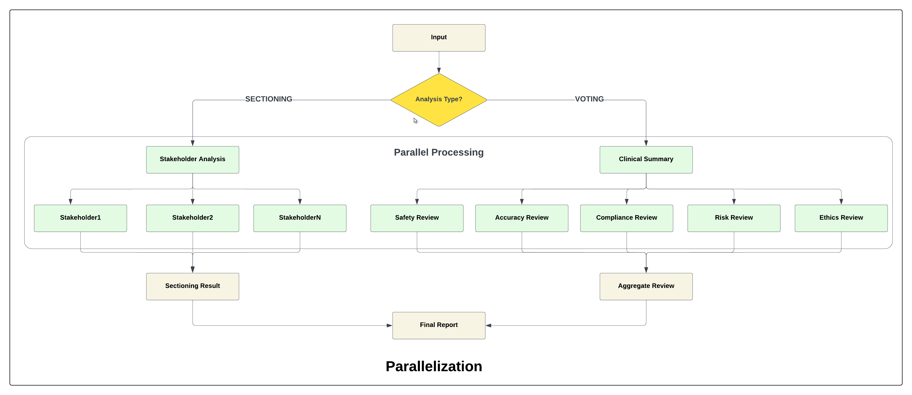
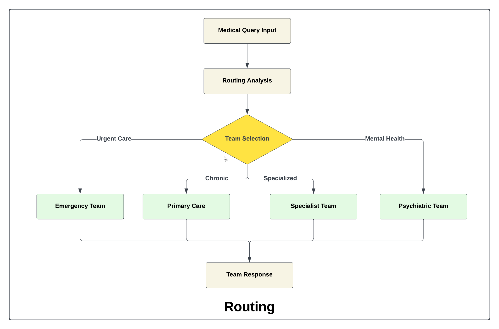
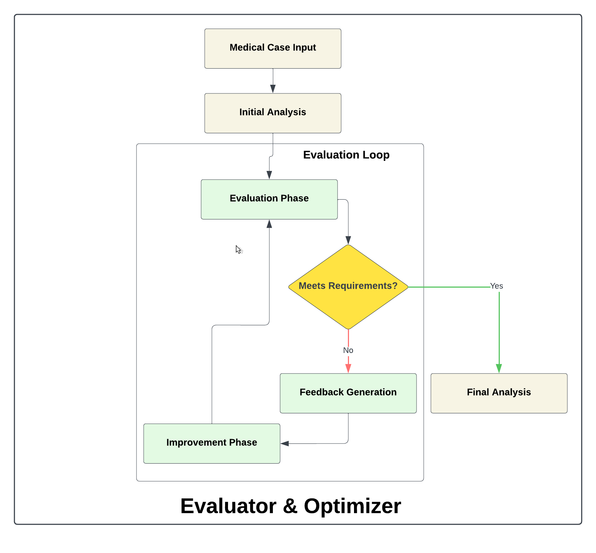
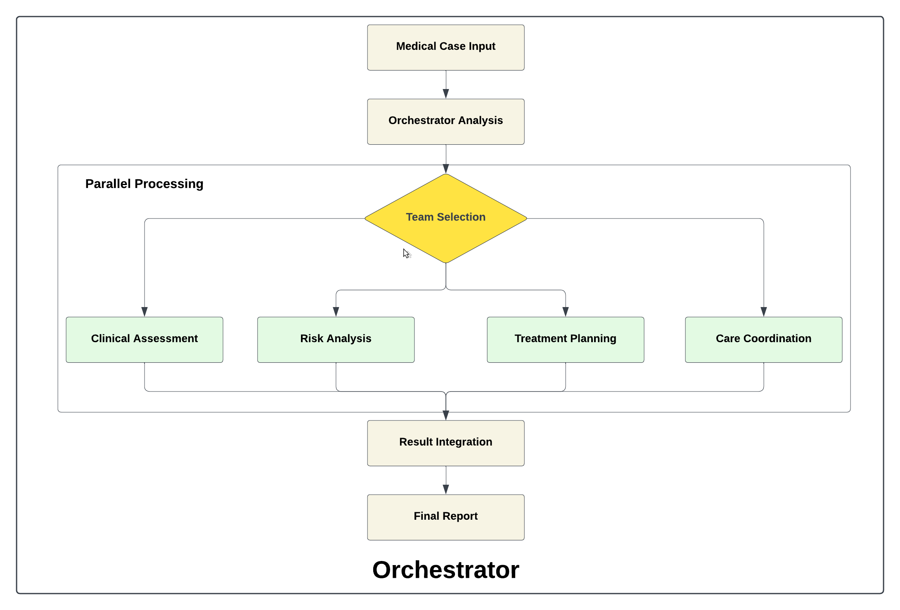
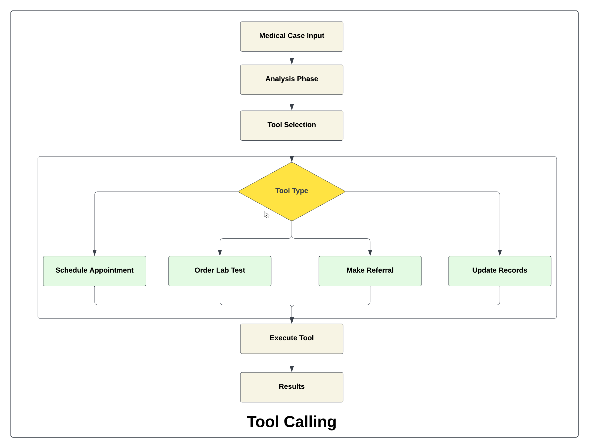

<div align="center">
   
</div>

### ⚙️ Setup Instructions

- #### Prerequisites
   - Python 3.9 or higher
   - pip (Python package installer)

- #### Installation
   1. Clone the repository:
      ```bash
      git clone https://github.com/genieincodebottle/genaicodelab.git
      cd genaicodelab/agentic_ai/ai_workflow
      ```
   2. Create a virtual environment:
      ```bash
      python -m venv venv
      venv\Scripts\activate # On Linux -> source venv/bin/activate
      ```
   3. Install dependencies:
      ```bash
      pip install -r requirements.txt
      ```
   4. Rename `.env.example` to `.env` and update with appropriate values.
      - For **GROQ_API_KEY** follow this -> https://console.groq.com/keys
      - For **OPENAI_API_KEY** follow this -> https://platform.openai.com/api-keys
      - For **GOOGLE_API_KEY** follow this -> https://ai.google.dev/gemini-api/docs/api-key
      - For **ANTHROPIC_API_KEY** follow this -> https://console.anthropic.com/settings/keys
<
hr>

### 💻 Running the Application
To start the application, run:
```bash
streamlit run app.py
```
### AI Workflows

#### **Prompt Chaining**: Sequential prompts for basic analysis
<br>


#### **Parallelization**: Concurrent analysis tasks
<br>


#### **Query Routing**: Dynamic task distribution
<br>


#### **Evaluator/Optimizer**: Quality control and improvement
<br>


#### **Orchestrator**: Complex workflow management
<br>


#### **Tool Calling**: External tool integration
<br>
